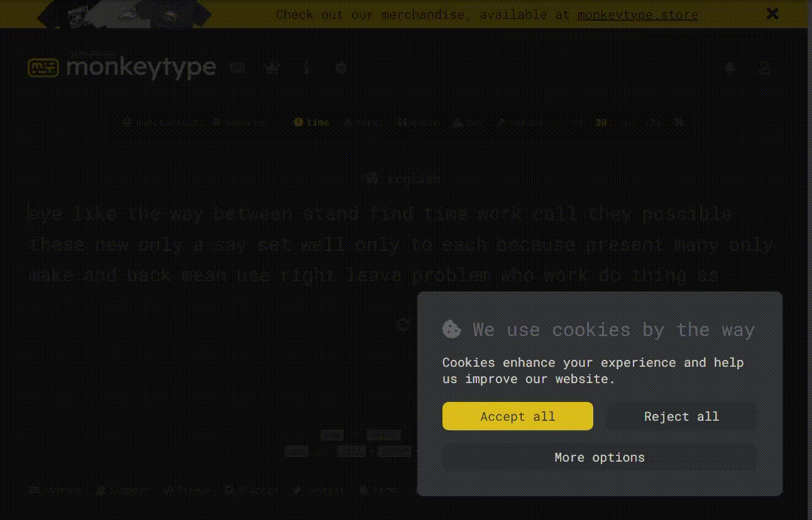

# CheatMonkey Type
Simple cheat monkey type with python Selenium!



Wrong: This Project Work for different chrome browser!  
check log for browser version!

For run start download Chromium ( and path in project folder ) or set new path chrome! ( automaticity downloaded if not found chrome )

install pipenv:

```
pip install pipenv
```

install all lib :

```
pipenv install
```

go to shell pipenv:
```
pipenv shell
```

And run code:

```
python main.py
```

enjoy!